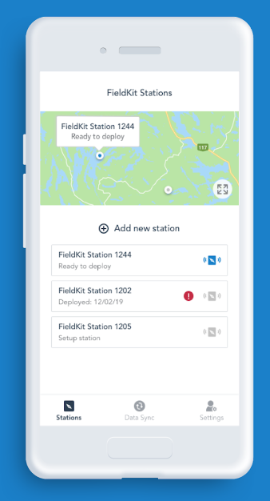

`# 📱 FieldKit Mobile App

Stay ahead in the field with FieldKit mobile app. Here's everything you need to get started to build the FieldKit app.

This version is for contributors or developers, to download the [Android app](https://play.google.com/store/apps/details?id=com.fieldkit) or the [iOS app](https://apps.apple.com/us/app/fieldkit-org/id1463631293).



## Table of Contents
- [Prerequisites](#prerequisites)
- [Setup and Dependencies](#setup-and-dependencies)
- [Running the Code](#running-the-code)
- [Running the Tests](#running-the-tests)

## 🛠 Prerequisites

Before you get started, ensure you have the following installed:

- **Flutter SDK**: [Installation Guide](https://docs.flutter.dev/get-started/install)
- **Rust Language**: [Get Rustup](https://rustup.rs/)
- **Rust Targets**: For cross-compiling to your device. [Read More](https://rust-lang.github.io/rustup/cross-compilation.html)

### Android-Specific Dependencies:
- **cargo-ndk**: [Installation Instructions](https://github.com/bbqsrc/cargo-ndk#installing)
- **Android NDK 22**: After installation, set its path using:

```bash
echo "ANDROID_NDK=path/to/ndk" >> ~/.gradle/gradle.properties
```

## 📦 Setup and Dependencies


### .env

You will need to copy `env.template` to `.env`

### RustFK

By default, `rustfk` will be downloaded from git when building the native rust
library for the application.

If you're going to be making changes to the rust side of the application, it's
handy to develop against a local working copy of the `rustfk` library.

For most development you can build against the default git revision and no
local copy is necessary.

1. **Clone the Repository**:
```bash
git clone https://github.com/fieldkit/rustfk
```

2. **Integrate your Rust code**: Edit `api.rs` as needed. Afterwards, get the "just" task runner:
```bash
cargo install just
```

3. **Generate Bridge Files**:
   First, ensure the codegen tool's version matches `flutter_rust_bridge` in `pubspec.yaml` and `flutter_rust_bridge` & `flutter_rust_bridge_macros` inside `native/Cargo.toml`.

```bash
cargo install -f --version 2.0.0-dev.28 flutter_rust_bridge_codegen
```

4. **Run gen**

```just gen```


> 🔧 **Tip**: Whenever you adjust the version in `pubspec.yaml`, ensure to run `flutter clean`.
> 🔧 **Tip2**: If running on Linux, run the following command before all else.
>```sudo apt-get install build-essential libssl-dev pkg-config libsqlite3-dev```

### 🍏 iOS Troubleshooting

Facing build issues with iOS? Try the following:

- **Licensing issues**:
```bash
xcodebuild -license
```

- **Missing iOS platforms**:
```bash
xcodebuild -downloadPlatform iOS
```

- **Installing simulators**:
```bash
xcodebuild -runFirstLaunch
```

OR

```bash
xcodebuild -downloadAllPlatforms
```

## 🏃 Running the Code 

Run the Flutter application with:

```bash
flutter run
```

## Errors about `libffi` architecture

First of all, I'm so sorry this is happening to you because this was one of the
most frustrating errors I've ever gotten. There's a clue in the build log,
though, which is rare. It suggests this:

```
sudo gem uninstall ffi && sudo arch -x86_64 gem install ffi -- --enable-libffi-alloc
```

Somehwat related, if you find you get the opposite error, you may need to
specify the architecture then as well, for example:

```
arch -x86_64 pod repo update
```

## Errors about `#import <FlutterMacOS/FlutterMacOS.h>`

This is usually the `MACOS_DEPLOYMENT_TARGET` and friends.

Double check the `post_install` step of the `Podfile` and be sure that
`flutter_additional_macos_build_settings` is being called, or
`flutter_additional_ios_build_settings` for `iOS`.

## 🧪 Running the Tests

Test the Flutter application with:

```bash
flutter test
```

## 📖 Updating Strapi
To Update Strapi, or the static content, run:
```bash
just test
```
then
```bash
just sync
```